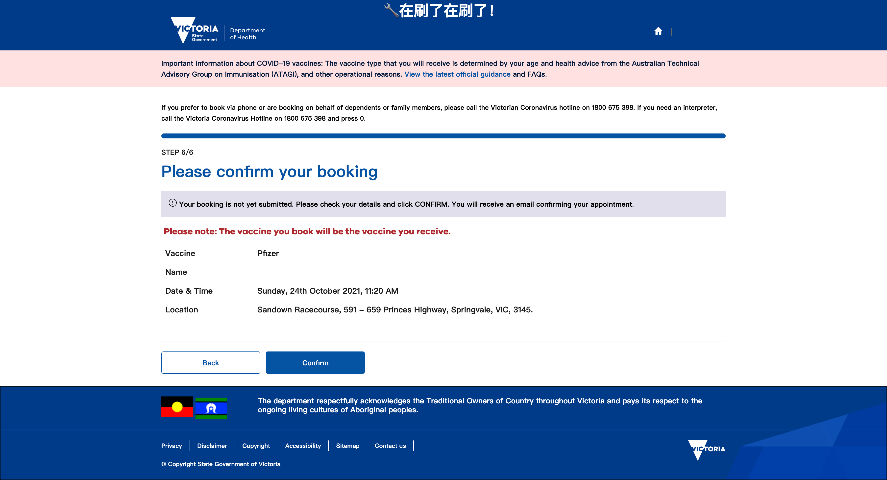

# 一个很不自动的维州疫苗预约自动刷新器
维州这个预约系统实在拉的不行.半天刷不到第二针就写了个脚本..  
刷新部分是用[oixm](https://greasyfork.org/en/scripts/39506-%E8%87%AA%E5%8A%A8%E5%88%B7%E6%96%B0%E9%A1%B5%E9%9D%A2/code)的刷新器改的  
测试环境mac+chrome(~~随手写的没怎么测试过.有问题给我发邮件吧<receyuki@gmail.com>~~)
## 使用流程
1. 在chrome上安装[Tampermonkey](https://chrome.google.com/webstore/detail/tampermonkey/dhdgffkkebhmkfjojejmpbldmpobfkfo)
2. 安装[本脚本](https://github.com/receyuki/VicVaccineAutoRefresher/raw/main/VicVaccineAutoRefresher.user.js)
3. 手动登陆[预约官网](https://portal.cvms.vic.gov.au/)，选择需要刷的接种点
4. 设置刷新间隔~~感觉一分钟够快了..再快就有点没素质~~，并设置好日期范围
5. 如果tab上能显示刷新倒计时说明刷新器在正确运行
6. 当脚本刷到新slot会自动弹窗（最小化浏览器也没事..别关页面就行）
7. 点击弹窗会自动跳转到confirm页面
8. 确认没问题的话自己点confirm吧(~~所以根本一点都不自动~~)